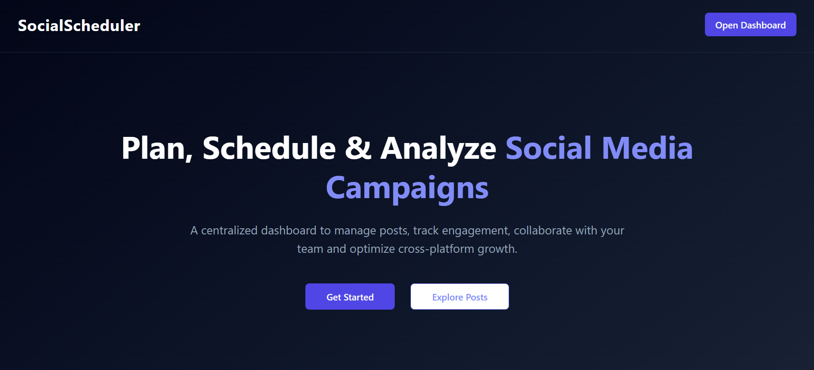
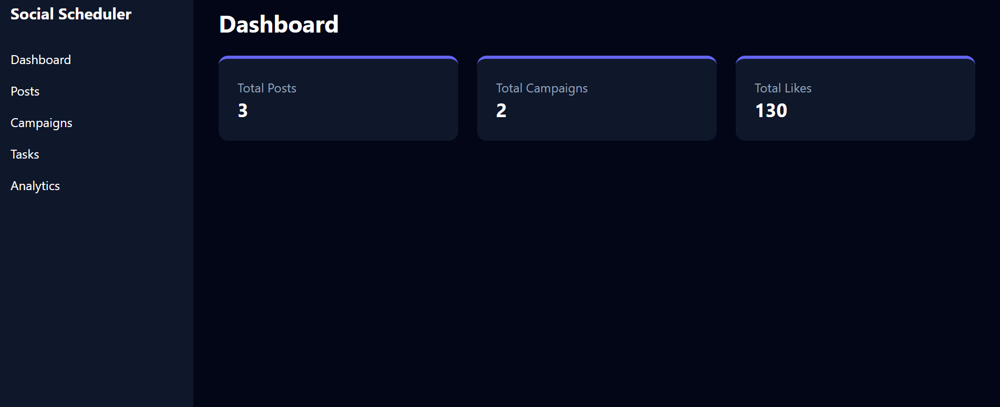
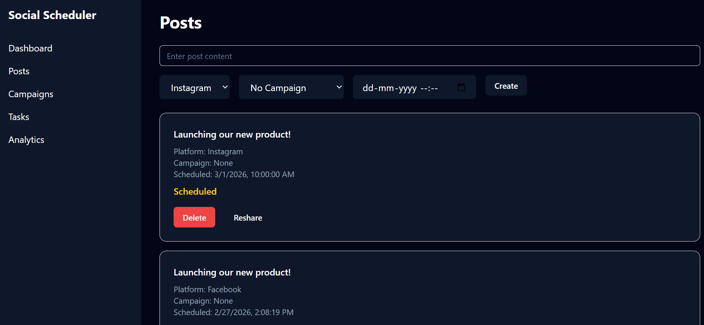
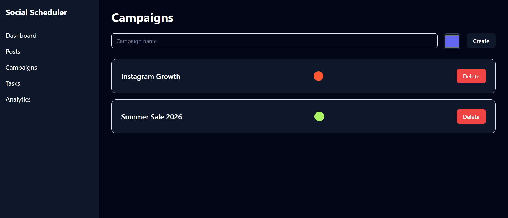
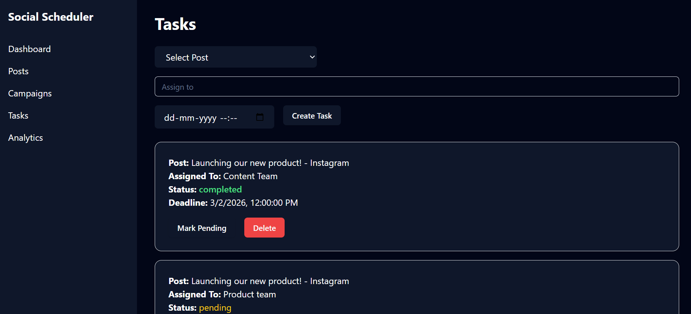
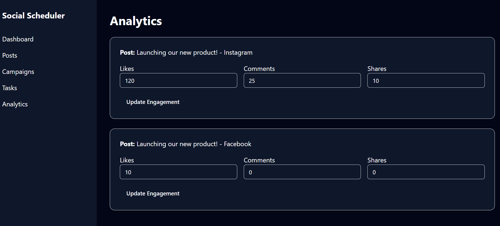

# Social Media Content Scheduler – Frontend

## 📌 Project Description

The Social Media Content Scheduler is a full-stack application designed to help social media managers plan, schedule, and analyze content across multiple platforms from a centralized dashboard.

This frontend application provides a modern SaaS-style UI built with React, Tailwind CSS, and ShadCN UI components. It allows users to manage campaigns, schedule posts, track engagement analytics, and collaborate using tasks.

---

## 🚀 Features

- Landing Page
- Dashboard Overview (Posts, Campaigns, Likes Summary)
- Create & Schedule Posts
- Multi-Platform Support (Instagram, Facebook, Twitter, LinkedIn, Pinterest)
- Campaign Management
- Task Assignment & Status Toggle
- Auto Publish Simulation
- Analytics Dashboard
- Platform-wise Engagement Insights
- Post Resharing
- Responsive Dark Theme UI

---

## 🛠 Tech Stack

- React (Vite)
- Tailwind CSS
- ShadCN UI
- Axios
- React Router

---

## 📂 Folder Structure
src/
│
├── components/
├── pages/
├── services/
├── context/
└── App.jsx

---

## ⚙️ Installation Steps

1. Clone repository
2. Navigate to frontend folder
3. Install dependencies
npm install
4. Start development server
npm run dev

---

## 🌐 Deployment Link

https://social-media-scheduler-system.netlify.app/

---

## 🔗 Backend API Link

https://social-media-scheduler-backend.onrender.com/

---

## 📸 Screenshots

### Landing Page

### Dashboard

### Posts Page

### Campaigns Page

### Tasks Page

### Analytics Page

---

## 🎥 Video Walkthrough

https://drive.google.com/file/d/1xyzRXjjKbdWir4VOHIHYVucTU8LQhXmx/view?usp=sharing

---

## 👩‍💻 Author

Developed as part of Masai School Full Stack Project.